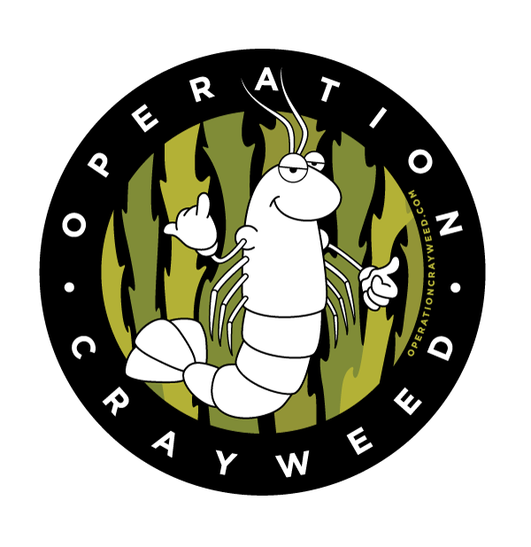
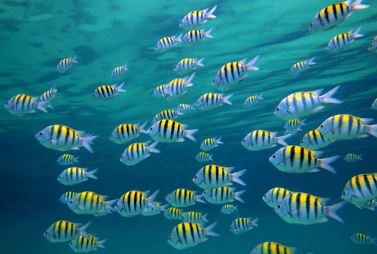

```{r setup, echo=FALSE, message=FALSE, warning=FALSE}
knitr::opts_chunk$set(
  echo = FALSE, fig.align = 'center', message = FALSE
)
```

```{r, include=FALSE}
packages = c('here')
lapply(packages, require, character.only=TRUE)
```

## Equivalence testing | Inception
- Commonly used in pharmaceutical development [@berger]

## Classical hypothesis testing {.smaller}
```{r, out.width='80%', fig.cap='$H_0: d = 0$ <br> $H_a: d > 0$'}
knitr::include_graphics(here('images', 'one_sided_test0.png'))
```

## Classical hypothesis testing {.smaller}
```{r, out.width='80%', fig.cap='$H_0: d = 0$ <br> $H_a: d > 0$'}
knitr::include_graphics(here('images', 'one_sided_test.gif'))
```

## Equivalence testing {.smaller}
```{r, out.width='70%', fig.cap='$H_0: d \\le -0.05 \\text{ or } d \\ge 0.05$ <br> $H_a: -0.05 < d < 0.05$'}
knitr::include_graphics(here('images', 'equiv0.png'))
```

## Equivalence testing
```{r, out.width='70%', fig.cap='A: Equivalent and not significant (effect is **equivalent**)'}
knitr::include_graphics(here('images', 'equivA.png'))
```

## Equivalence testing
```{r, out.width='70%', fig.cap='A: Equivalent and not significant (effect is **equivalent**) <br> B: Equivalent and significant (effect is **equivalent**)'}
knitr::include_graphics(here('images', 'equivB.png'))
```

## Equivalence testing
```{r, out.width='70%', fig.cap='A: Equivalent and not significant (effect is **equivalent**) <br> B: Equivalent and significant (effect is **equivalent**) <br> C: Not equivalent and not significant (effect is **inconclusive**)'}
knitr::include_graphics(here('images', 'equivC.png'))
```

## Equivalence testing
```{r, out.width='70%', fig.cap='A: Equivalent and not significant (effect is **equivalent**) <br> B: Equivalent and significant (effect is **equivalent**) <br> C: Not equivalent and not significant (effect is **inconclusive**) <br> D: Not equivalent and significant (effect is **inferior**)'}
knitr::include_graphics(here('images', 'equivD.png'))
```

## Equivalence testing
```{r, out.width='70%', fig.cap='A: Equivalent and not significant (effect is **equivalent**) <br> B: Equivalent and significant (effect is **equivalent**) <br> C: Not equivalent and not significant (effect is **non-inferior**) <br> D: Not equivalent and significant (effect is **superior**)'}
knitr::include_graphics(here('images', 'equivCD.png'))
```

## How to set the bounds? {.build}
<div class='incremental'>
- What is your effect size of interest?
</div>
<div class='incremental'>
- Cohen's small-medium-large effect thresholds
  + Small effect = 0.2
  + Medium effect = 0.5
  + Large effect = 0.8
</div>
<div class='incremental'>
- <p style="color:red">Always pre-specify!</p>
</div>

## Ecological restoration
- Restoration can be considered successful if there is evidence of
**similarity** between the restored and reference sites

## Operation Crayweed | The problem {.smaller}
<div class="rows-2">
  <div class="columns-2">
  ```{r, out.width='70%', fig.cap='Stormwater drain'}
  knitr::include_graphics(here('images', 'drain.png'))
  ```

  ```{r, out.width='70%', fig.cap='Ocean floor without crayweed'}
  knitr::include_graphics(here('images', 'nocrayweedsmall.png'))
  ```
  </div>
  <div align="right">
  <p style="font-size:x-small">
  [Click to find out more! {width=12%}](http://www.operationcrayweed.com/){target="_blank"}
  </p>
  </div>
</div>

## Operation Crayweed | The solution {.smaller}
<div style="float: left; width: 50%;">
```{r, out.width='55%', fig.cap='Reference site'}
knitr::include_graphics(here('images', 'ref.png'))
```

```{r, out.width='55%', fig.cap='Restored site'}
knitr::include_graphics(here('images', 'rest.png'))
```
</div>

<div style="float: left; width: 50%;">
```{r, out.width='45%', fig.cap='Locations'}
knitr::include_graphics(here('images', 'map.png'))
```
</div>

## TOSTER
Install packages
```{r, echo=TRUE, eval=FALSE}
install.packages(c('TOSTER', 'ecoCopula', 'mvabund', 'devtools'))
devtools::install_github('lsjmichelle/ecopower@1e5d39a')
```

Load package
```{r, echo=TRUE, message=FALSE, warning=FALSE}
library(TOSTER)
```

## Species richness data {.smaller}
```{r, echo=TRUE}
data('crayweed', package='ecopower')
abund = crayweed$abund
X = crayweed$X

data = data.frame(richness = rowSums(abund>0))
data$treatment = X$treatment
data$treatment = factor(data$treatment, levels=c('restored', 'reference'))
head(data)
```
<div align="right">
{width=20%}
</div>

## TOSTER | Specifying the effect - Cohen's d
```{r}
plot_cohen = function(seed, d) {
  n = 30; mean = 3
  set.seed(seed)
  ref = rnorm(n, mean+d)
  set.seed(seed)
  rest = rnorm(n, mean)
  
  dstar = mean(ref) - mean(rest)
  
  if (abs(dstar - d)<0.02) {
    if (d == 0.2) {
        main = 'Small'
    } else if (d == 0.5) {
        main = 'Medium'
    } else {
        main = 'Large'
    }
    
    boxplot(
        ref, rest,
        names=c("reference","restored"),
        col=c('lightblue', 'pink'),
        main=paste(main, 'effect =', d)
    )
  }
}

par(mfrow=c(1,3))
plot_cohen(1, 0.2)
plot_cohen(1, 0.5)
plot_cohen(1, 0.8)
```

## TOSTER | Testing for equivalence {.smaller}
```{r, message=FALSE, echo=TRUE}
dataTOSTtwo(
  data, deps='richness', group='treatment',
  low_eqbound=-0.8, high_eqbound=0.8,
  var_equal=TRUE, desc=TRUE, plots=TRUE
)
```

## TOSTER | Too few samples? {.build .smaller}
<div class="incremental">
```{r, echo=TRUE}
powerTOSTtwo(alpha=0.05, N=14, low_eqbound_d=-0.8, high_eqbound_d=0.8)
```
</div>

<div class="incremental">
```{r, echo=TRUE}
powerTOSTtwo(alpha=0.05, statistical_power=0.8, low_eqbound_d=-0.8, high_eqbound_d=0.8)
```
</div>

## TOSTER | Testing for non-inferiority {.smaller}
```{r, message=FALSE, echo=TRUE}
dataTOSTtwo(
  data, deps='richness', group='treatment',
  low_eqbound=-0.8, high_eqbound=Inf,
  var_equal=TRUE, desc=TRUE, plots=TRUE
)
```

## Multivariate equivalence testing {.build .smaller}
<div class="incremental">
```{r, echo=TRUE}
cbind(abund[1:6,2:4], head(X))
```
</div>

<div class="incremental">
```{r, out.width='60%', fig.cap='Mean-variance relationship'}
knitr::include_graphics(here('images', 'datamvr.png'))
```
</div>

## Multivariate equivalence testing | How to specify the effect?
_Problem_: Each species has its own parameter to estimate effect size.
How do we decide what effect size to use for each species?

## Multivariate equivalence testing | Specifying the effect {.smaller .build}
<div class="incremental">
- _Solution_: Classify each species as an
  + increaser
  + decreaser
  + no-effect
- Assume a constant effect size (e.g. 50% change in mean abundance)
</div>
<div class="incremental">
```{r, out.width='70%'}
increasers = c(
  'Abudefduf.sp.', 'Acanthurus.nigrofuscus', 'Chromis.hypsilepis',
  'Parma.microlepis', 'Pempheris.compressa', 'Scorpis.lineolatus',
  'Trachinops.taeniatus'
)

decreasers = c(
  'Aplodactylus.lophodon', 'Atypichthys.strigatus', 'Cheilodactylus.fuscus',
  'Olisthops.cyanomelas', 'Pictilabrus.laticlavius'
)

fish = data.frame(matrix(nrow=2,ncol=34,dimnames = list(NULL, colnames(abund))))
fish[1:2,] = 1
fish[2, increasers] = 1.5
fish[2, decreasers] = 1/1.5

plot(
  1:34, fish[1,],
  type="l", ylim=c(0.6,1.6),
  ylab="Proportion of mean abundances",
  xlab = "", xaxt='n', col='blue',
  main="Mean abundance proportions in restored sites relative to reference sites\nfor a specified effect size of 1.5"
)
lines(1:34, fish[2,], col='red',type='o')
legend(
  "bottomright", legend=c("Ref", "Rest"), lty=c(1,1), title="", lwd = 1,
  col=c("blue","red"), inset=0.01, box.lty = 0, y.intersp = 0.8, cex=0.8
)
text(
  1:34,
  par("usr")[3]-0.01,
  srt = 50,
  adj = 1,
  xpd = TRUE,
  labels = paste(colnames(fish)), cex = 0.65
)
```
</div>

## Multivariate equivalence testing
We will use the `ecopower` package, which fits a _copula model_ [@popovic].
```{r, echo=TRUE, message=FALSE, warning=FALSE}
library(ecopower)
library(ecoCopula)
library(mvabund)
```
Copula models have two steps:
<p>
<ol>
<li>Fit a marginal model (separate for each species)
```{r, echo=TRUE}
fit = manyglm(abund ~ time + treatment, family='negative.binomial', data=X)
```
<li>Fit a correlation model (to residuals)
```{r, echo=TRUE}
fit.cord = cord(fit)
```
</ol>

## Multivariate equivalence testing | Specifying the effect
```{r, echo=TRUE}
increasers = c(
  'Abudefduf.sp.', 'Acanthurus.nigrofuscus', 'Chromis.hypsilepis',
  'Parma.microlepis', 'Pempheris.compressa', 'Scorpis.lineolatus',
  'Trachinops.taeniatus'
)

decreasers = c(
  'Aplodactylus.lophodon', 'Atypichthys.strigatus', 'Cheilodactylus.fuscus',
  'Olisthops.cyanomelas', 'Pictilabrus.laticlavius'
)

effect_mat = effect_alt(fit, effect_size=1.5, increasers, decreasers, term='treatment')
```

## Multivariate equivalence testing
```{r, echo=TRUE, eval=TRUE}
equivtest(fit.cord, coeffs=effect_mat)
```

## Conclusion {.build}
<div class="incremental">
- Equivalence test is useful when we want evidence of _similiarity_
</div>
<div class="incremental">
- The key step is specifying effect size. Harder for multivariate data!
</div>
<div class="incremental">
- Try `TOSTER` for univariate equivalence tests
</div>
<div class="incremental">
- Try `equivtest` in `ecopower` on GitHub for multivariate abundances
```{r, echo=TRUE, eval=FALSE}
devtools::install_github('lsjmichelle/ecopower@1e5d39a')
```
</div>
<div class="incremental">
- See [R Notebook](code.html){target="_blank"} for details
</div>

## Thank you!
```{r, out.width='40%'}
knitr::include_graphics(here('images', 'bg.jpg'))
```

```{r, out.width='35%'}
knitr::include_graphics(here('images', 'giphy.gif'))
```

## References
